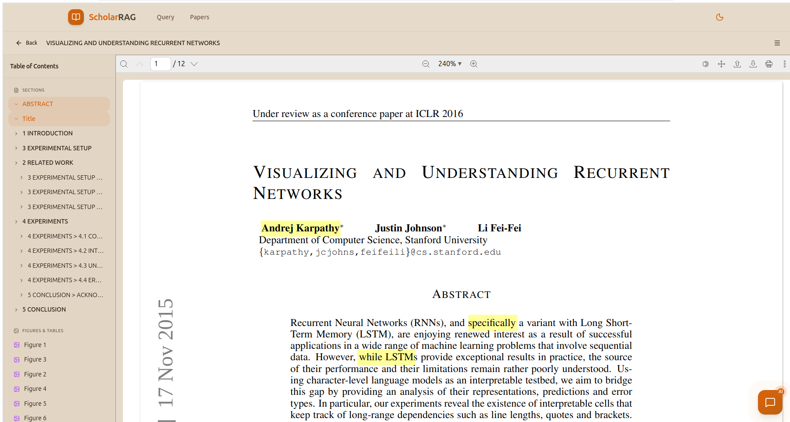
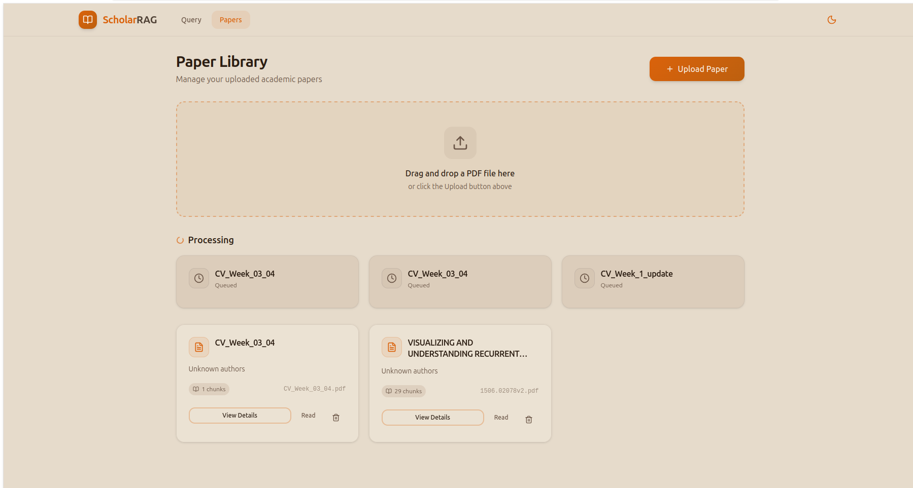

# RAGPaper

> Multimodal Retrieval-Augmented Generation (RAG) System for Academic Literature

RAGPaper is a **multimodal RAG system** designed specifically for academic researchers. It not only understands and retrieves text from papers, but also parses **complex tables, charts, and mathematical formulas**, providing researchers with a deep, intelligent literature interaction experience.




---

## 🌟 Core Features

### 🤖 Intelligent Agent Engine
- **Powered by LangGraph**: A robust state machine-based agent architecture capable of autonomously planning research steps, executing tool calls, and synthesizing research findings.
- **Multimodal Reasoning**: Agents can "see" and analyze visual evidence in papers (charts/tables), providing more comprehensive answers.
- **Dynamic Toolchain**: Includes diverse tools such as semantic search, visual retrieval, and page context expansion.

### 📄 Smart PDF Parsing
- **MinerU Integration**: High-precision academic PDF parsing that extracts cross-references between text, images, and formulas.
- **Unified Service Layer**: A centralized ingestion pipeline ensuring consistent processing across both CLI and Web interfaces.

### 🔍 Multimodal Embedding & Retrieval
- **Qwen3-VL Embeddings**: A Qwen3-VL-based multimodal embedding model supporting mixed text and image inputs.
- **LangChain Compatible**: Implements the `langchain_core.embeddings.Embeddings` interface for seamless integration.
- **Hybrid Search**: Supports dense vector + sparse BM25 retrieval (optional).
- **MMR Support**: Maximal Marginal Relevance ensures diversity in search results.

### 💻 Modern Web Interface
- **Immersive Chat**: Full-screen focus mode with LaTeX formula rendering support (KaTeX).
- **Thought Process Visualization**: Collapsible reasoning process display to observe the agent's research steps in real-time.
- **Rich Citations**: Every answer includes links to the source paper and specific pages.
- **Integrated PDF Reader**: Built-in PDF viewer supporting direct jumps to cited pages.

### ⚡ Performance Optimization
- **VRAM Optimization**: Models loaded using `bfloat16`/`float16` precision, reducing memory footprint by approximately **50%**.
- **Thread-safe Repository Pattern**: Lazy initialized singleton via `get_vector_store()`, isolating business logic from the Qdrant vector database and supporting concurrent access.
- **Asynchronous Support**: Built-in async methods enabling non-blocking operations.

### 🛡️ Security & Stability
- **Generic Error Messages**: Returns concise external error messages while logging complex details internally, preventing implementation detail leaks.

### 📊 Version Management
- **Automated Version Control**: Automatically creates new versions when re-indexing papers, retaining history.
- **Current Version Filtering**: Defaults to retrieving only current version chunks, avoiding interference from history.
- **Version History Viewer**: The frontend interface displays all versions, supporting detailed historical views.

### ⚡ Asynchronous Uploads & Job Management
- **Asynchronous Processing**: Non-blocking large file uploads immediately return a job ID.
- **Real-time Progress**: Poll for processing progress (parsing, embedding, storing).
- **Job Retries**: Failed jobs support one-click retries, automatically cleaning up before reprocessing.
- **Persistent State**: All job states are saved in SQLite; no progress is lost across restarts.
- **Database Lease Locks**: Supports lease locking via `ingestion_jobs.status + leased_at + leased_by` to prevent multiple workers from handling the same job.
- **Configurable Executors**: Background executors can switch between thread pools and process pools. CPU-intensive PDF parsing can utilize process pools for parallelism.

### 🧪 Offline Evaluation Pipeline
- **6 Evaluation Metrics**: Retrieval Hit Rate, Page Hit Rate, Keyword Match Rate, Citation Coverage Rate, Current Version Leak Rate, and Failed Query Rate.
- **Threshold Gating**: Configurable thresholds that automatically fail CI pipelines if unmet.
- **JSON Reports**: Machine-readable evaluation reports supporting historical comparisons.

---

## 🏗️ System Architecture

```
RAGPaper/
├── main.py                    # CLI Entry (add/query/delete subcommands)
├── api/                       # FastAPI Backend
│   ├── main.py               # Application factory, CORS, routing
│   ├── config.py             # API config (host, port, upload paths)
│   ├── schemas.py              # Pydantic request/response models
│   ├── routes/                # Endpoint handlers
│   │   ├── papers.py         # Paper management
│   │   ├── query.py            # Query endpoints
│   │   └── conversations.py    # Chat history endpoints
│   └── services/              # Business logic layer
│       ├── paper_service.py    # Paper service
│       ├── query_service.py    # Query service
│       └── conversation_service.py
├── frontend/                  # React + TypeScript SPA
│   ├── src/
│   │   ├── components/        # Reusable UI components
│   │   ├── pages/             # Route-level views
│   │   ├── hooks/             # Custom React Hooks
│   │   ├── stores/            # Zustand state management
│   │   └── lib/               # Utility functions
│   └── package.json
├── config/
│   └── settings.py            # Settings dataclass loading from .env
├── src/
│   ├── core/                  # Core business logic
│   │   └── ingestion.py       # Ingestion services
│   ├── agent/                 # LangGraph Agent
│   │   ├── graph.py           # State machine definition
│   │   ├── tools.py           # Tool definitions
│   │   ├── langgraph_agent.py # Agent implementations
│   │   └── multimodal_answerer.py
│   ├── custom/                # Qwen3-VL wrappers
│   │   ├── qwen3_vl_embedding.py
│   │   └── vision_utils.py
│   ├── ingest/                # MinerU parser
│   │   ├── mineru_parser.py
│   │   └── paper_manager.py
│   ├── rag/                   # Vector storage & retrieval
│   │   ├── vector_store.py    # Qdrant multimodal store
│   │   └── embedding.py
│   ├── utils/
│   │   └── logger.py          # Logging utilities
│   └── jobs/                  # Jobs and Version management
│       ├── job_manager.py     # Async job tracker
│       └── version_manager.py # Version control tracker
├── tests/
│   └── evaluation/           # Offline evaluation pipeline
│       ├── runner.py
│       ├── dataset.json
│       └── thresholds.json
├── data/                      # Data output (gitignored)
│   ├── parsed/               # MinerU outputs
│   ├── uploads/              # Temporary file uploads
│   └── RAGPaper.db         # SQLite persistent state
└── .github/workflows/        # GitHub Actions CI/CD
```

---

## 🚀 Quick Start

### Requirements

- **Python**: 3.12+
- **Node.js**: 18+ (for frontend)
- **Qdrant**: Local or cloud vector database
- **GPU**: NVIDIA GPU (RTX 2080 Ti or higher recommended)

### 1. Clone & Install

```bash
# Clone the repository
git clone <repository-url>
cd RAGPaper

# Create Python environment
conda create -n RAGPaper python=3.12
conda activate RAGPaper

# Install dependencies
pip install -r requirements.txt

# Install MinerU (PDF Parser)
pip install -U mineru[all]
```

### 2. Configure Environment

```bash
# Copy the example environment template
cp .env.example .env

# Edit .env and configure these critical settings:
# - OPENAI_API_KEY: Your OpenAI API Key
# - OPENAI_API_BASE: API base URL (Default: http://localhost:8000/v1)
# - EMBEDDING_MODEL: Qwen3-VL embedded model path
# - QDRANT_HOST, QDRANT_PORT: Qdrant service addresses
# - QDRANT_COLLECTION_NAME: Qdrant collection name (Default: RAGPaper)
# - LLM_MODEL: Large Language Model name (Default: Pro/moonshotai/Kimi-K2.5)
```

### 3. Start Services

**Method 1: Command Line (CLI)**

```bash
# Add a paper to the vector store
python main.py add path/to/paper.pdf

# Query papers
python main.py query "What is the core methodology of this paper?"

# Delete a paper
python main.py delete paper_name
```

**Method 2: Web Services**

```bash
# Start the Backend (Terminal 1)
uvicorn api.main:app --host 0.0.0.0 --port 8000

# Start the Frontend (Terminal 2)
cd frontend
npm install
npm run dev

# Visit http://localhost:5173
```

### 4. Docker Deployment

```bash
docker build -t RAGPaper .
docker compose up -d

# Health Check
curl http://localhost:8000/api/health

# Prometheus Metrics
curl http://localhost:8000/metrics
```

Container orchestration will automatically start up:
- `api` (FastAPI)
- `qdrant` (Vector database)
- `redis` (Cache/Queue base component)

The `.dockerignore` safely excludes `data/`, `models/`, and `qdrant_storage/` sizes from the image footprint.

---

## 📖 Usage Guide

### CLI Commands

| Command | Description | Example |
|------|------|------|
| `add <pdf_path>` | Ingest PDF into the vector store | `python main.py add ./papers/dream.pdf` |
| `query <question>` | Ask the RAG agent a question | `python main.py query "What's the core idea of DREAM?"` |
| `delete <pdf_name>` | Delete a paper locally | `python main.py delete dream` |

### API Endpoints

| Method | Endpoint | Description |
|------|------|------|
| POST | `/api/papers/upload` | Upload PDF (Synchronous) |
| POST | `/api/papers/uploads` | Async upload processing |
| GET | `/api/papers/uploads` | Get upload job list |
| GET | `/api/papers/uploads/{job_id}` | Get job details |
| POST | `/api/papers/uploads/{job_id}/retry` | Retry a failed job |
| GET | `/api/papers` | List all ingested papers |
| GET | `/api/papers/{pdf_name}/versions` | List paper version history |
| POST | `/api/papers/{pdf_name}/reindex` | Force re-index a paper |
| DELETE | `/api/papers/{name}` | Delete a paper entirely |
| POST | `/api/query/stream` | Stream queries via SSE |
| GET | `/api/conversations` | Retrieve dialogue history |
| DELETE | `/api/conversations/{id}` | Clear a conversation |

### Environment Variables (.env)

| Variable | Description | Default |
|------|------|--------|
| `OPENAI_API_BASE` | OpenAI-compatible API host | `http://localhost:8000/v1` |
| `OPENAI_API_KEY` | API Key | `""` |
| `LLM_MODEL` | LLM Model Name | `Pro/moonshotai/Kimi-K2.5` |
| `EMBEDDING_MODEL` | Embedding Model Path | `models/Qwen3-VL-Embedding-2B` |
| `QDRANT_HOST` | Qdrant Gateway IP | `localhost` |
| `QDRANT_PORT` | Qdrant Port | `6333` |
| `QDRANT_COLLECTION_NAME` | Main collection | `RAGPaper` |
| `RAG_TOP_K` | Vector retrieval top-K count | `5` |
| `SCORE_THRESHOLD` | Minimum match similarity threshold | `0.3` |
| `AGENT_MAX_ITERATIONS` | Max loops for Agentic RAG | `10` |
| `ENABLE_HYBRID` | Activate dense+sparse queries | `false` |
| `MINERU_BACKEND` | MinerU core implementation | `pipeline` |
| `PDF_STORAGE_DIR` | Directory holding physical PDFs | `./data/pdfs` |
| `PARSED_OUTPUT_DIR` | Directory holding parsed artifacts | `./data/parsed` |
| `LOG_LEVEL` | Log Output Mode | `INFO` |
| `LOG_FORMAT` | Message format template | `%(asctime)s - %(name)s - %(levelname)s - %(message)s` |
| `USE_DB_JOB_LEASE` | Enable database-level task locks | `false` |
| `JOB_LEASE_TTL_SECONDS` | Lease expiration limits (sec) | `300` |
| `EXECUTOR_TYPE` | Processor backing ('thread' or 'process') | `thread` |
| `BACKGROUND_EXECUTOR_WORKERS` | Async executor size limit | `2` |

---

## 🛠️ Technology Stack

### AI/ML
- [LangGraph](https://github.com/langchain-ai/langgraph) - Agentic workflows orchestration
- [LangChain](https://github.com/langchain-ai/langchain) - Core LLM interfaces
- [Qwen3-VL](https://github.com/QwenLM/Qwen-VL) - Multimodal intelligence models
- [Transformers](https://github.com/huggingface/transformers) - Huggingface architecture
- PyTorch - Deep learning backend

### Data & State
- [Qdrant](https://qdrant.tech/) - High-performance Vector Store
- [SQLite](https://sqlite.org/) - Queue & Lifecycle Relational state

### Backend
- FastAPI - High-speed web serving
- Pydantic v2 - Safe serialization
- Prometheus Client - Systems monitoring
- Tenacity - Fallback retries and circuit breaker

### Frontend
- React 19 - Framework
- TypeScript - Typing safety
- Tailwind CSS - Component styling
- shadcn/ui - Beautiful unstyled interface tools
- KaTeX - Lightning fast LaTeX renderers
- Zustand - State logic abstraction

### Processing
- [MinerU](https://github.com/opendatalab/MinerU) - Premium grade document parser

---

## 🔄 CI/CD

RAGPaper continuously verifies reliability using GitHub Actions:

```yaml
# .github/workflows/ci.yml
- Backend Linter (ruff)
- Unit Testing (pytest)
- Offline Evaluation Runner (RAG checks)
- Frontend Builder (npm run build)
```

Triggered automatically on commits strictly impacting main branch or PR pushes.

---

## 🧪 Evaluation Pipeline

### Running Offline Evaluations

```bash
python -m tests.evaluation.runner \
  --dataset tests/evaluation/dataset.json \
  --output reports/evaluation_report.json \
  --thresholds-file tests/evaluation/thresholds.json
```

### Metrics Guardrails

- **Retrieval Hit Rate**: Measures document recall
- **Page Hit Rate**: Direct indexing correlation
- **Keyword Match Rate**: Terminological density metrics
- **Citation Coverage Rate**: Completeness of source attribution
- **Current Version Leak Rate**: Historic version mitigation checks
- **Failed Query Rate**: Graceful failure measurements

### Configurations

Thresholds managed centrally in `tests/evaluation/thresholds.json`. CI fails out of pipeline specifications if sub-standard scoring observed.

---

## 🧪 Development Practices

### Python Linting Standards

```bash
# Style enforcing & format commands
ruff check .              # Validate
ruff check --fix .       # Fix safe problems
ruff format .            # Autoformat rules

# Testing suites
pytest                   # Full pass runner
pytest -x                # Terminate early pattern
```

### Frontend Toolkit

```bash
cd frontend

# Development
npm run dev              # http://localhost:5173

# Deploy Output
npm run build

# Rules Validations
npm run lint
```

### Repositories Norms

- **Import Orders**: Standard libraries → Third party packages → Local bindings.
- **Type Hintings**: Enforced parameter and robust return indications via Python typed syntax.
- **Definitions Structure**: 
  - Class instances: `PascalCase`
  - Function bindings: `snake_case`
  - Constants mapping: `UPPER_SNAKE_CASE`
  - Private methods: `_leading_underscore`
- **Error Exceptions Catching**: Always intercept explicitly rather than naked `except:`. Fail gracefully towards UI but stackdump purely to backend logstreams.
- **Logging Protocols**: Exclusively access trace logic sequentially using `get_logger(__name__)`. Bare `print()` statements are firmly disallowed everywhere.

---

## ⚠️ Important Pitfalls

1. **CUDA / vLLM Contamination Hazards**: Ensure you don't bootstrap `vector_store` globals across scopes before models initialize safely. Relegate logic deeply around `get_vector_store()`.
2. **Persistence Lifecycle Guarding**: Never rely upon `client.search()`. Strictly target proxy abstraction wrapper functions including `similarity_search()`.
3. **Idempotent Ingestion Protection**: Vector indexes explicitly correlate via deterministic `uuid.uuid5` implementations to nullify re-insertion cascades safely.
4. **Imagery Referencing Modes**: Probing images systematically references dual modes bridging `auto/<img_path>` alongside `auto/images/<img_path>`.

---

## 📄 License

MIT License © RAGPaper Team

---


